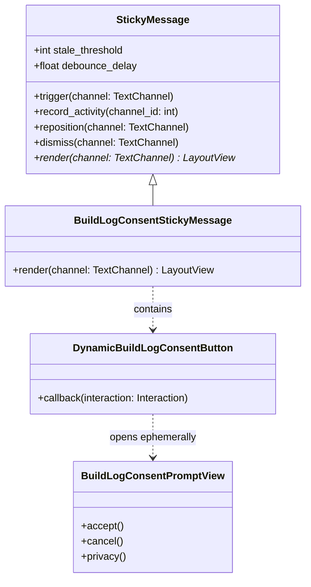

# Implementation Plan - Reusable Sticky Message & Build Ingestion Consent

Build a generic, reusable **`StickyMessage`** abstraction in [`squid.bot.utils.sticky_message`](file:///home/admin/Redstone-Squid/squid/bot/utils/sticky_message.py) to manage debounced, bottom-pinned Discord channel notices. Then, use this utility to enforce user consent before ingesting builds from `#build-logs` and `#record-logs`, displaying a debounced channel prompt with an ephemeral consent flow.

---

## Goal Description

Discord channels like `#build-logs` and `#record-logs` receive build submissions that the bot infers and saves. To respect user privacy and legal rights:
1. **Ingestion Gate**: The bot must ignore messages from unconsented users and not create account records for them.
2. **Reusable Sticky Message Mechanism**: A general-purpose utility [`StickyMessage`](file:///home/admin/Redstone-Squid/squid/bot/utils/sticky_message.py) to keep messages pinned near the bottom of a channel by deleting and resending, debounced to tolerate 1–3 messages of staleness.
3. **Build Log Consent Prompt**: A concrete `BuildLogConsentStickyMessage` that displays a public card with an interactive button (`DynamicBuildLogConsentButton`).
4. **Ephemeral Consent Interaction**: Clicking the button opens an ephemeral consent card (`BuildLogConsentPromptView`) where the user can read the privacy notice, review terms, and grant consent (`AccountConsent.grant_current()`).

---

## User Review Required

> [!IMPORTANT]
> **Reusable Sticky Message Architecture**: We extract the sticky message logic into a clean, reusable component [`squid/bot/utils/sticky_message.py`](file:///home/admin/Redstone-Squid/squid/bot/utils/sticky_message.py) with configurable staleness threshold (`stale_threshold`, default 3), debounce delay (`debounce_delay`, default 5.0s), and per-channel concurrency locks. Any future feature (rules banners, event reminders, format templates) can reuse this utility directly.

> [!NOTE]
> **Consent Scope**: We integrate seamlessly with the existing `AccountConsent` domain model and `AccountService`. Unconsented users' messages will produce no database records and no AI inference calls until consent is granted.

---

## Architecture & Reusable Component Hierarchy



---

## Proposed Changes

Grouped by component layer:

### Bot Utilities — Generic Sticky Message

---

#### [NEW] `squid/bot/utils/sticky_message.py`

A reusable, framework-consistent utility for managing bottom-pinned sticky messages in any Discord text channel.

```python
"""Reusable sticky message coordinator with debounced channel repositioning."""

import abc
import asyncio
import logging
from collections.abc import Callable, Coroutine
from typing import Any, override

import discord
from discord import TextChannel

logger = logging.getLogger(__name__)

DEFAULT_STALE_THRESHOLD = 3
DEFAULT_DEBOUNCE_DELAY = 5.0


class StickyMessage(abc.ABC):
    """Coordinates a sticky message pinned to the bottom of Discord channels.

    Maintains a single message per channel by deleting the prior instance and sending a new one.
    To avoid rate-limit churn and message spam during active conversations, repositioning is
    debounced: it allows up to `stale_threshold` messages before forcing an immediate reposition,
    and uses a trailing timer (`debounce_delay`) during quiet periods.
    """

    def __init__(
        self,
        *,
        stale_threshold: int = DEFAULT_STALE_THRESHOLD,
        debounce_delay: float = DEFAULT_DEBOUNCE_DELAY,
    ) -> None:
        self.stale_threshold = stale_threshold
        self.debounce_delay = debounce_delay
        self._last_message_id: dict[int, int] = {}
        self._messages_since_reposition: dict[int, int] = {}
        self._locks: dict[int, asyncio.Lock] = {}
        self._debounce_tasks: dict[int, asyncio.Task[None]] = {}

    def _lock_for(self, channel_id: int) -> asyncio.Lock:
        if channel_id not in self._locks:
            self._locks[channel_id] = asyncio.Lock()
        return self._locks[channel_id]

    @abc.abstractmethod
    async def render(self, channel: TextChannel) -> discord.ui.LayoutView:
        """Render the layout view to display in the sticky message."""
        ...

    def is_active_in(self, channel_id: int) -> bool:
        """Whether a sticky message is currently tracked in the given channel."""
        return channel_id in self._last_message_id

    def get_message_id(self, channel_id: int) -> int | None:
        """Return the ID of the current sticky message in the channel, if any."""
        return self._last_message_id.get(channel_id)

    def record_activity(self, channel_id: int) -> None:
        """Record general message activity in the channel to track staleness."""
        if channel_id in self._last_message_id:
            self._messages_since_reposition[channel_id] = (
                self._messages_since_reposition.get(channel_id, 0) + 1
            )

    async def trigger(self, channel: TextChannel) -> None:
        """Request the sticky message be posted or refreshed in the channel.

        If no sticky message exists or the staleness threshold has been reached, repositions
        immediately. Otherwise, schedules a trailing debounce timer.
        """
        channel_id = channel.id
        self.record_activity(channel_id)
        staleness = self._messages_since_reposition.get(channel_id, 0)
        has_message = channel_id in self._last_message_id

        if not has_message or staleness >= self.stale_threshold:
            await self.reposition(channel)
        else:
            self._schedule_debounce(channel)

    def _schedule_debounce(self, channel: TextChannel) -> None:
        channel_id = channel.id
        existing = self._debounce_tasks.get(channel_id)
        if existing is not None and not existing.done():
            return

        async def _delayed_reposition() -> None:
            try:
                await asyncio.sleep(self.debounce_delay)
                await self.reposition(channel)
            except asyncio.CancelledError:
                pass

        self._debounce_tasks[channel_id] = asyncio.create_task(_delayed_reposition())

    async def reposition(self, channel: TextChannel) -> None:
        """Force immediate deletion of the old sticky message and posting of a new one."""
        async with self._lock_for(channel.id):
            task = self._debounce_tasks.pop(channel.id, None)
            if task is not None and not task.done():
                task.cancel()

            old_id = self._last_message_id.get(channel.id)
            if old_id is not None:
                try:
                    old_msg = channel.get_partial_message(old_id)
                    await old_msg.delete()
                except (discord.NotFound, discord.Forbidden, discord.HTTPException):
                    logger.debug(
                        "Could not delete previous sticky message %s in %s",
                        old_id,
                        channel.id,
                        exc_info=True,
                    )

            view = await self.render(channel)
            try:
                new_msg = await channel.send(view=view)
                self._last_message_id[channel.id] = new_msg.id
                self._messages_since_reposition[channel.id] = 0
            except (discord.Forbidden, discord.HTTPException):
                logger.warning("Failed to send sticky message in channel %s", channel.id, exc_info=True)

    async def dismiss(self, channel: TextChannel) -> None:
        """Delete the current sticky message and remove it from active tracking."""
        async with self._lock_for(channel.id):
            task = self._debounce_tasks.pop(channel.id, None)
            if task is not None and not task.done():
                task.cancel()

            old_id = self._last_message_id.pop(channel.id, None)
            self._messages_since_reposition.pop(channel.id, None)
            if old_id is not None:
                try:
                    old_msg = channel.get_partial_message(old_id)
                    await old_msg.delete()
                except (discord.NotFound, discord.Forbidden, discord.HTTPException):
                    pass


class FunctionalStickyMessage(StickyMessage):
    """A sticky message defined via a renderer callback rather than subclassing."""

    def __init__(
        self,
        renderer: Callable[[TextChannel], Coroutine[Any, Any, discord.ui.LayoutView]],
        *,
        stale_threshold: int = DEFAULT_STALE_THRESHOLD,
        debounce_delay: float = DEFAULT_DEBOUNCE_DELAY,
    ) -> None:
        super().__init__(stale_threshold=stale_threshold, debounce_delay=debounce_delay)
        self._renderer = renderer

    @override
    async def render(self, channel: TextChannel) -> discord.ui.LayoutView:
        return await self._renderer(channel)
```

---

### Bot Submission & Consent Components

---

#### [NEW] `squid/bot/submission/consent_banner.py`

Implements:
1. `BuildLogConsentStickyMessage`: Subclasses `StickyMessage` to render the public banner with `DynamicBuildLogConsentButton`.
2. `DynamicBuildLogConsentButton`: `DynamicItem` persistent button triggering ephemeral consent flow.
3. `BuildLogConsentPromptView`: Tailored consent view explaining build ingestion permissions.

```python
"""Build log ingestion consent banner and ephemeral permission flow."""

import logging
from typing import Any, Self, override

import discord
from discord import Interaction, TextChannel
from discord.ui import DynamicItem, Item

from squid.accounts.domain import (
    CURRENT_CONSENT_VERSION,
    AccountConsent,
    IdentityProvider,
)
from squid.bot.consent import ConsentPromptView
from squid.bot.i18n import resolve_locale, t
from squid.bot.utils.components import StaticLayout, no_mentions, text_layout
from squid.bot.utils.sticky_message import StickyMessage
from squid.core.i18n import _

logger = logging.getLogger(__name__)

CONSENT_BUTTON_CUSTOM_ID = "build_log:consent"


class DynamicBuildLogConsentButton[
    BotT: "squid.bot.app.RedstoneSquid",
    V: discord.ui.LayoutView,
](discord.ui.DynamicItem[discord.ui.Button[V]], template=r"build_log:consent"):
    """Public button on the channel consent banner opening an ephemeral consent prompt."""

    def __init__(self) -> None:
        super().__init__(
            discord.ui.Button(
                label="Enable Build Ingestion",
                style=discord.ButtonStyle.primary,
                custom_id=CONSENT_BUTTON_CUSTOM_ID,
                emoji="📋",
            )
        )

    @classmethod
    @override
    async def from_custom_id(
        cls: type[Self], interaction: Interaction[BotT], item: Item[Any], match: Any, /
    ) -> Self:
        return cls()

    @override
    async def callback(self, interaction: Interaction[BotT]) -> Any:
        await interaction.response.defer(ephemeral=True)
        locale = await resolve_locale(interaction, interaction.client.services.settings)
        accounts = interaction.client.services.accounts

        account = await accounts.get_account_by_identity(IdentityProvider.DISCORD, str(interaction.user.id))
        if account is not None and account.id is not None and not account.needs_consent_refresh:
            await interaction.followup.send(
                view=text_layout(
                    t(
                        locale,
                        _(
                            "### Consent Already Granted\n"
                            "Your account has already accepted the current privacy notice. Redstone Squid automatically "
                            "indexes your submissions in build log channels.\n\n"
                            "*Tip:* If you posted a build before your consent was recorded, right-click that message and "
                            "select **Apps > Recalculate Build** to index it now."
                        ),
                    )
                ),
                ephemeral=True,
                allowed_mentions=no_mentions(),
            )
            return

        view = BuildLogConsentPromptView(interaction.user.id, locale=locale)
        msg = await interaction.followup.send(
            view=view,
            ephemeral=True,
            wait=True,
            allowed_mentions=no_mentions(),
        )
        view.bind_message(msg)
        await view.wait()

        if view.consent is not None:
            await accounts.get_or_create_identity(
                IdentityProvider.DISCORD, str(interaction.user.id), consent=view.consent
            )
            await interaction.followup.send(
                view=text_layout(
                    t(
                        locale,
                        _(
                            "### Consent Recorded!\n"
                            "Thank you! Your consent has been recorded under notice `{version}`. Your future builds "
                            "posted in build-log channels will now be automatically ingested and submitted for voting.\n\n"
                            "*Tip:* To ingest a build you posted recently, right-click your message and select "
                            "**Apps > Recalculate Build**."
                        ),
                        version=CURRENT_CONSENT_VERSION,
                    )
                ),
                ephemeral=True,
                allowed_mentions=no_mentions(),
            )


class BuildLogConsentPromptView(ConsentPromptView):
    """Customized consent card highlighting build log ingestion permissions."""

    @override
    def _title(self, locale: str | None) -> str:
        return t(locale, _("Enable Automatic Build Ingestion"))

    @override
    def _summary(self, locale: str | None) -> str:
        return t(
            locale,
            _(
                "Redstone Squid automatically indexes redstone doors and builds posted in this channel. "
                "Agreeing stores your Discord user ID and records this consent, allowing the bot to attribute "
                "your builds, mirror media, and analyze attached schematics. Cancelling stores nothing and leaves "
                "your posts ignored by automated ingestion."
            ),
        )

    @override
    def _accept_label(self, locale: str | None) -> str:
        return t(locale, _("Agree & Enable Ingestion"))


class BuildLogConsentStickyMessage(StickyMessage):
    """Sticky banner posted in build-log channels when unconsented users post."""

    @override
    async def render(self, channel: TextChannel) -> discord.ui.LayoutView:
        return StaticLayout(
            discord.ui.TextDisplay(
                "## 📋 Build Log Ingestion Consent\n"
                "Redstone Squid automatically indexes and tracks redstone door and build submissions in this channel. "
                "To attribute your builds, parse schematics, and record your scores, the bot requires your consent to store "
                "your Discord user ID.\n\n"
                "Messages from unconsented users are not ingested. Click below to review permissions and enable automated ingestion."
            ),
            discord.ui.ActionRow(DynamicBuildLogConsentButton()),
        )
```

---

#### [MODIFY] `squid/bot/submission/__init__.py`

Register `DynamicBuildLogConsentButton` with the bot's tree:
```python
bot.add_dynamic_items(DynamicBuildEditButton, DynamicBuildLogConsentButton)
```

---

#### [MODIFY] `squid/bot/submission/submit.py`

Incorporate `BuildLogConsentStickyMessage`:
1. Initialize `self.consent_sticky = BuildLogConsentStickyMessage()`.
2. In `infer_build_from_message`:
   - Check author consent.
   - If not consented:
     `await self.consent_sticky.trigger(message.channel)`
     `return`
   - If consented:
     `self.consent_sticky.record_activity(message.channel.id)`
     Proceed with ingestion.
3. In `recalc_context_menu`:
   - Check author consent. If unconsented, reply with clear error and `await self.consent_sticky.trigger(message.channel)`.

---

### Tests

---

#### [NEW] `tests/unit/bot/utils/test_sticky_message.py`

Unit tests for the reusable `StickyMessage` base class:
- `test_first_trigger_sends_sticky_message_immediately`
- `test_subsequent_triggers_debounce_within_stale_threshold`
- `test_reaching_stale_threshold_repositions_immediately`
- `test_reposition_deletes_old_message_and_resets_staleness`
- `test_reposition_handles_missing_or_already_deleted_message`
- `test_dismiss_deletes_message_and_clears_state`
- `test_functional_sticky_message_uses_renderer_callback`

#### [NEW] `tests/unit/bot/submission/test_consent_banner.py`

Integration tests for the consent banner & dynamic button:
- `test_unconsented_post_triggers_build_log_sticky_message`
- `test_consented_post_records_channel_activity_without_banner_trigger`
- `test_dynamic_consent_button_shows_already_consented_to_consented_user`
- `test_dynamic_consent_button_grants_consent_and_updates_account`
- `test_dynamic_consent_button_cancel_stores_no_account`

#### [MODIFY] `tests/unit/bot/submission/test_build_recalc.py`

- Add `test_recalc_refusal_when_author_unconsented`.

---

## Verification Plan

### Automated Tests
```bash
# 1. Reusable sticky message utility tests
uv run pytest tests/unit/bot/utils/test_sticky_message.py --no-cov

# 2. Submission & consent gate tests
uv run pytest tests/unit/bot/submission tests/unit/bot/test_consent_gate.py --no-cov

# 3. Architecture & lint checks
uv run pytest tests/architecture --no-cov
uv run ruff format --check squid tests
uv run ruff check squid tests
git diff --check
```

### Type Checking
```bash
just typecheck
```

### Manual Verification
1. Test in a live channel: send a message from an unconsented user.
2. Confirm the sticky banner appears with the button.
3. Post 1–2 messages from other users: observe that the banner stays in place without spamming.
4. Post a 3rd message: observe that the old banner is deleted and a new banner appears at the bottom.
5. Click "Enable Build Ingestion": grant consent via the ephemeral prompt.
6. Verify future messages from that user are immediately ingested.
